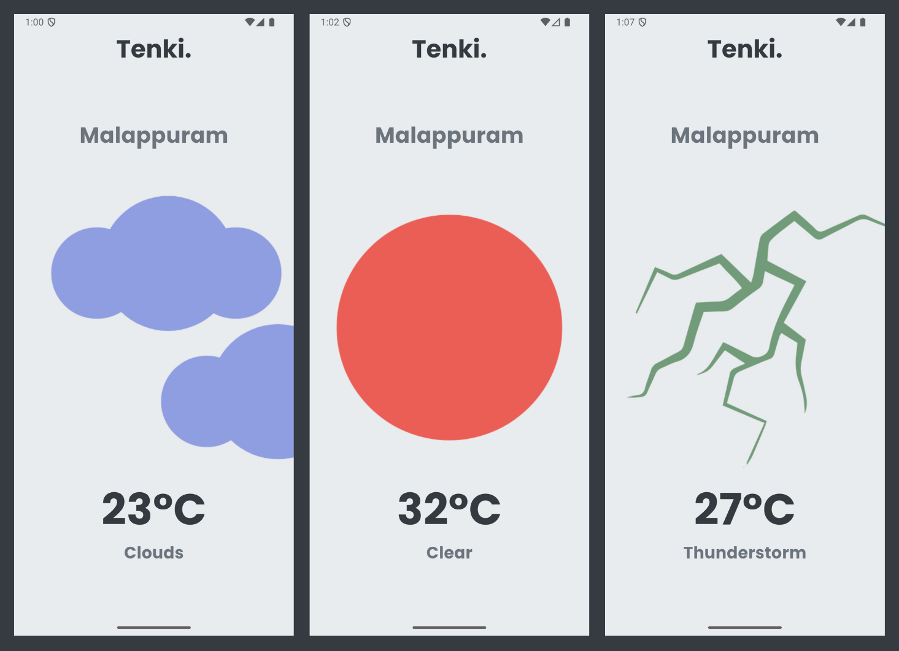

# Tenki. ☁️

**Tenki** is a minimal weather app built using Flutter. It shows current weather details like temperature, condition, and location in a soft and modern UI.
---
## 🌟 Features

- Real-time weather display (temperature, condition, city name)
- Automatic location-based weather data
- Custom typography using **Poppins**
- Clean and soft color palette
---
## 🖼️ Screenshots
 
> 
---
## 🧱 Tech Stack

- **Flutter**: UI framework
- **Dart**: Programming language
- **Google Fonts**: For custom typography
- **OpenWeatherMap API**: For real-time weather data
- **geolocator**: For fetching device location
---
## 🎨 Theming

- Background: `Color(0xFFE9ECEF)`
- Font: **Poppins**
- Font Color: `Color(0xFF343A40)` used globally
- Weather condition text and temperature are **rounded** and styled cleanly

---

## 📁 Folder Structure (Simplified)

```
tenki/
├── assets/
│   └── images/
│       └── bg.png
├── lib/
│   └── main.dart
├── pubspec.yaml
├── README.md
└── ...
```
---
## 🧾 License

This project is licensed under the [MIT License](LICENSE).

